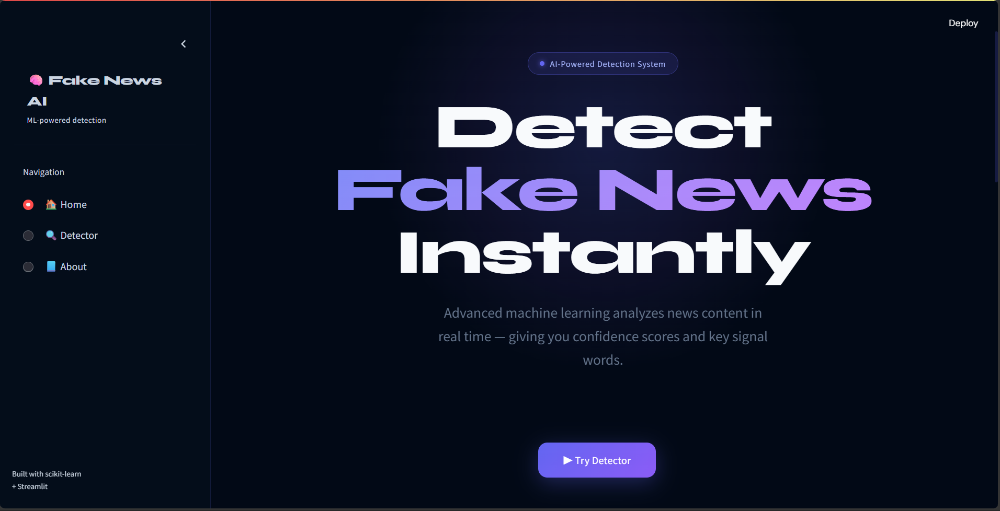
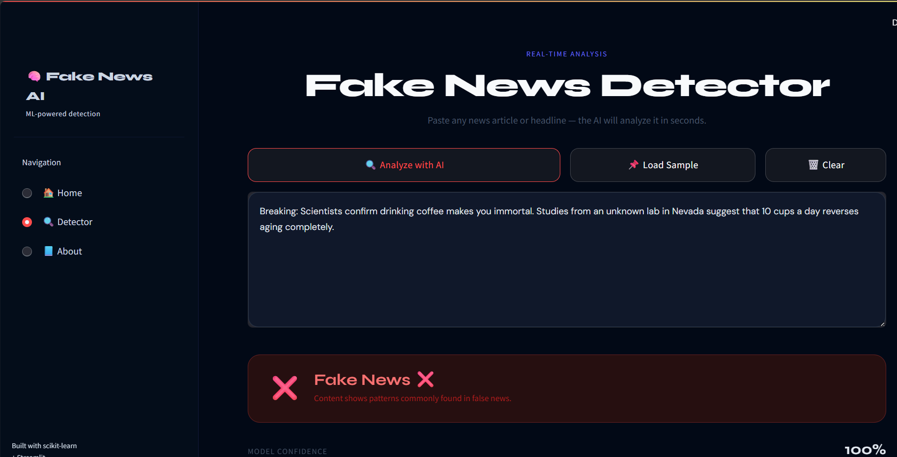
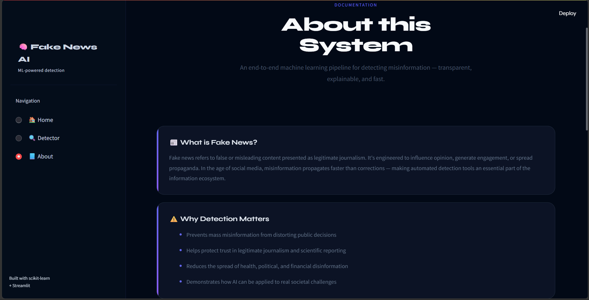

# 🧠 Fake News AI — Detection System

<div align="center">


**An end-to-end AI system that detects fake news in real time using NLP and Machine Learning.**

[🚀 Live Demo](https://fake-news-detector-l27wkvntua4wqmebkhrghb.streamlit.app/) · [📸 Screenshots](#screenshots) · [⚙️ Installation](#installation) · [🤝 Contributing](#contributing)

</div>

---

## 📌 Overview

Fake News AI is a full-stack machine learning web application that classifies news articles as **Real** or **Fake** with a confidence score. Built with a **Passive Aggressive Classifier** trained on TF-IDF features, it also highlights the key signal words that drove the prediction — making the AI fully explainable.

> Originally scaffolded with ChatGPT, then redesigned and polished with Claude for UI, responsiveness, and UX improvements.

---

## ✨ Features

| Feature | Description |
|---|---|
| ⚡ Real-time Detection | Instant classification on any pasted article or headline |
| 🎯 Confidence Score | Animated progress bar showing model certainty |
| 🔍 Explainable AI | Top 10 TF-IDF signal words shown as chips |
| 🧠 Word Highlighting | Key terms highlighted directly in your input text |
| 📊 Text Statistics | Word count, character count, unique word count |
| 📌 Sample Article | One-click sample for quick model testing |
| 🗑️ Clear Button | Instantly reset text and results for next article |
| 📱 Fully Responsive | Works on desktop, tablet, and mobile |
| 🎨 Premium Dark UI | Custom-styled Streamlit with Syne + DM Sans fonts |

---

## 🛠️ Tech Stack

```
Frontend     →  Streamlit + Custom CSS (no framework)
ML Model     →  scikit-learn PassiveAggressiveClassifier
Vectorizer   →  TF-IDF (max_df=0.7)
Preprocessing→  Custom NLP pipeline (regex, stopwords, lowercasing)
Serialization→  joblib (.pkl)
Language     →  Python 3.8+
Deployment   →  Streamlit Community Cloud
```

---

## 📁 Project Structure

```
fake-news-detector/
│
├── app.py                      # Main Streamlit entry point
│
├── components/                 # UI page modules (NOT pages/ — avoids Streamlit multipage)
│   ├── __init__.py
│   ├── Home.py                 # Landing page with hero + features
│   ├── Detector.py             # Core detection UI
│   └── About.py                # Project documentation page
│
├── src/                        # ML pipeline
│   ├── __init__.py
│   ├── data_preprocessing.py   # Text cleaning (regex, stopwords)
│   ├── feature_engineering.py  # TF-IDF vectorization
│   ├── train_model.py          # Model training script
│   ├── evaluate_model.py       # Accuracy evaluation
│   └── predict.py              # Prediction + confidence + signal words
│
├── models/                     # Saved model artifacts (git-ignored)
│   ├── model.pkl               # Trained PassiveAggressiveClassifier
│   └── vectorizer.pkl          # Fitted TF-IDF vectorizer
│
├── data/
│   └── raw/
│       ├── Fake.csv            # Fake news dataset (Kaggle)
│       └── True.csv            # Real news dataset (Kaggle)
│
├── main.py                     # Run this to train the model
├── requirements.txt
└── README.md
```

---

## 🚀 Installation

### 1. Clone the repository

```bash
git clone https://github.com/YOUR_USERNAME/fake-news-detector.git
cd fake-news-detector
```

### 2. Create a virtual environment (recommended)

```bash
python -m venv venv

# Windows
venv\Scripts\activate

# macOS / Linux
source venv/bin/activate
```

### 3. Install dependencies

```bash
pip install -r requirements.txt
```

### 4. Download the dataset

Download the **Fake and Real News Dataset** from Kaggle:
👉 https://www.kaggle.com/datasets/clmentbisaillon/fake-and-real-news-dataset

Place the files in:
```
data/raw/Fake.csv
data/raw/True.csv
```

### 5. Train the model

```bash
python main.py
```

This creates `models/model.pkl` and `models/vectorizer.pkl`.

### 6. Run the app

```bash
streamlit run app.py
```

Open your browser at `http://localhost:8501`

---

## 📸 Screenshots

| Home Page | Detector | About |
|---|---|---|
|  |  |  |

---

## 🧠 How It Works

```
User Input
    │
    ▼
Text Cleaning          → lowercase, remove URLs, punctuation, numbers, stopwords
    │
    ▼
TF-IDF Vectorization   → convert text to weighted numeric feature vector
    │
    ▼
PAC Model Predict      → PassiveAggressiveClassifier outputs 0 (Fake) or 1 (Real)
    │
    ▼
Confidence Score       → decision_function score mapped to 0–100%
    │
    ▼
Signal Words           → top 10 TF-IDF features from the input vector
    │
    ▼
Result UI              → animated banner + confidence bar + highlighted text
```

---

## 📊 Model Performance

| Metric | Score |
|---|---|
| Algorithm | Passive Aggressive Classifier |
| Vectorizer | TF-IDF (max_df=0.7) |
| Train/Test Split | 80% / 20% |
| Accuracy | **~95–98%** on Kaggle dataset |
| Dataset Size | ~44,000 articles |

> ⚠️ **Note:** Accuracy is measured on the Kaggle dataset. Real-world performance may vary depending on article source, writing style, and language.

---

## ☁️ Deployment

### Deploy to Streamlit Community Cloud (Free)

1. Push your project to GitHub (make sure `models/` is included or train on deploy)
2. Go to **[share.streamlit.io](https://share.streamlit.io)**
3. Click **"New app"**
4. Select your repository, branch (`main`), and set main file to `app.py`
5. Click **Deploy** — your app will be live in ~2 minutes

> **Important:** Add `models/model.pkl` and `models/vectorizer.pkl` to your repo, OR add a training step in your app startup. The `data/` folder (~500MB) should be in `.gitignore`.

### `.gitignore` (recommended)

```
data/
venv/
__pycache__/
*.pyc
.env
.DS_Store
```

---

## 📦 requirements.txt

```
pandas
scikit-learn
streamlit
joblib
numpy
```

---

## 🤝 Contributing

Pull requests are welcome! For major changes, please open an issue first.

1. Fork the repo
2. Create your feature branch: `git checkout -b feature/your-feature`
3. Commit your changes: `git commit -m 'Add some feature'`
4. Push to the branch: `git push origin feature/your-feature`
5. Open a Pull Request

---

## 📄 License

This project is licensed under the **MIT License** — see the [LICENSE](LICENSE) file for details.

---

## 👨‍💻 Author

**Your Name**
- GitHub: [@YOUR_USERNAME](https://github.com/hiteshparmar18)
- LinkedIn: [linkedin.com/in/YOUR_PROFILE](http://linkedin.com/in/hiteshparmar18/)
- Portfolio: [PORTFOLIO PROFILE](https://hitesh-portfolio-eta.vercel.app/)

---

<div align="center">
Built with ❤️ using Python, scikit-learn & Streamlit
</div>
